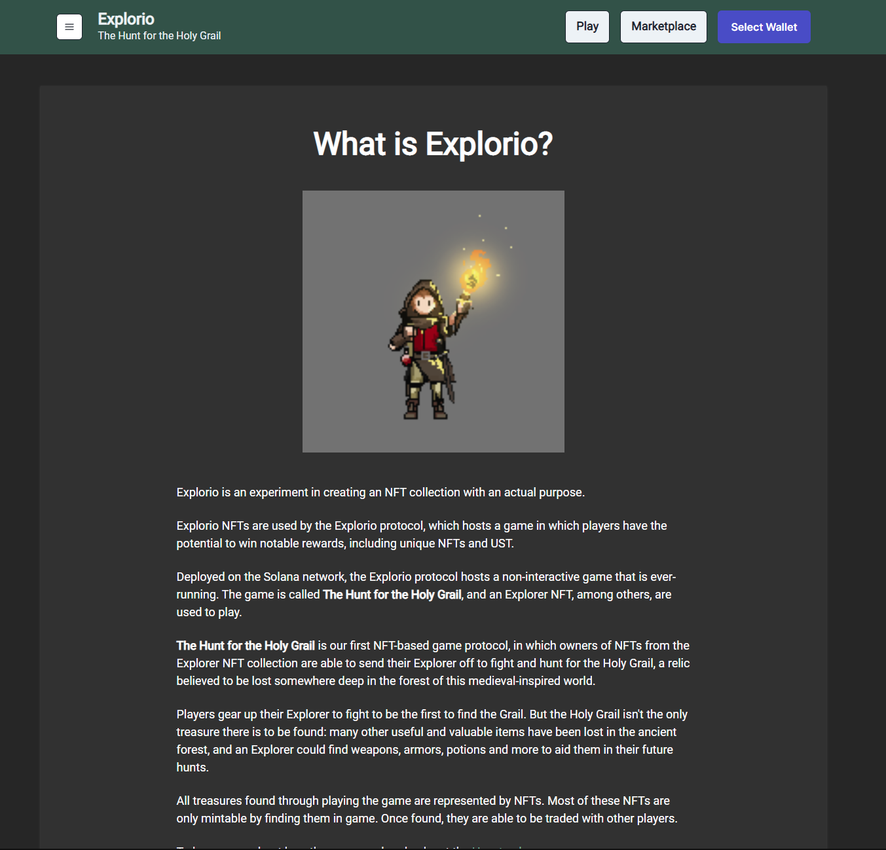
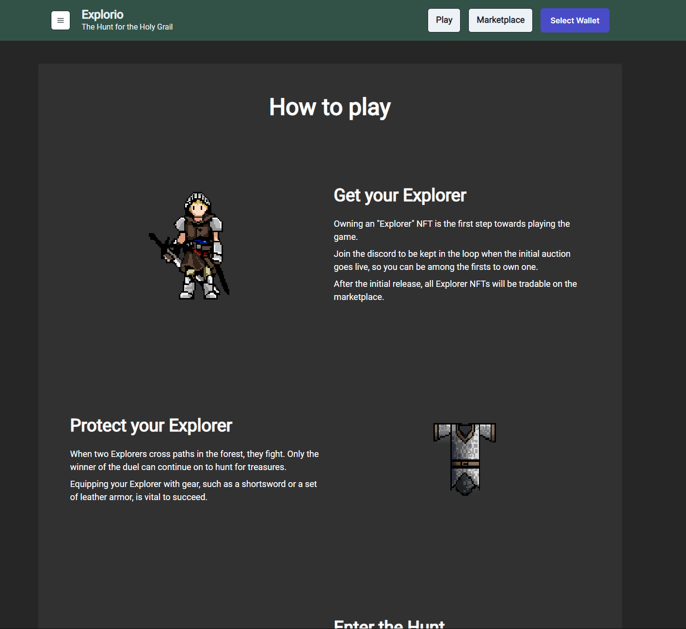

# Explorio

This project's purpose is to explore blockchain technology, specifically by developing a Solana Program using the [Anchor framework](https://book.anchor-lang.com/introduction/what_is_anchor.html).

The protocol's name is Explorio, and is an experiment in creating real value for NFTs through a non-interactive game protocol which drives users to use both fungible and non-fungible tokens (NFTs) to engage with the protocol, the marketplace, and through these two pathways create a small but functional economy around the game’s assets.

If you're here to learn about how the project intends to work in-depth, consider reading through the original planning document published [here](https://docs.google.com/document/d/e/2PACX-1vQhgWohoUQSFWEruZZdT754BSXSyL5rUWcQ7svMJRIn3SUdcMZRtlg6ukewm2EroCN-pTIU_tejdpyN/pub). Note this document is slightly out-of-date in certain respects, and was not originally written for public sharing.

## Current project state
A large amount of work has been completed, with a fair amount left to truly become launchable. 

The smart contract (/program) has nearly all of the required functionality implemented (deposits, withdrawals, processing hunts, state management of various tokens and rewards, a history account to maintain a ledger of past hunt results, and so on). That said there is a lot left to be done to become truly production-ready. Notably, the VRF provider (verifiably-random function) was never selected and was essentially stubbed out, though switchboard.xyz was looking promising on that front.

## Quick look
A non-functional version of the frontend has been deployed using netlify, and [can be accessed here](https://mellow-florentine-7a7c89.netlify.app/). Wallet functionality works, but the hunt simulation will require standing up a local solana validator and deploying the anchor program with proper parameters.

If you're here to browse the code, I would highly recommend reading through `programs/anchor-test/src`. That's where the cool stuff lives.

## Run
There are two pieces - the blockchain program (the meat of the project) and the frontend, which connects to the blockchain and can surface data about past and ongoing hunts. The frontend also surfaces information about how the project works.

All pieces are currently unfinished. It is possible to run a simulation against a local validator by deploying the contract and running `anchor test`. There are rough notes within `local/readme.txt` detailing how to set up to deploy the anchor contract, but this would first require properly setting up a local cluster to develop against.

### Frontend
to build the front end:
```
cd app/ && npm install && npm start
```

### Program
Deploying the backend locally requires an understanding of how to set up a solana test validator as well as how to test and deploy anchor programs. For more information, see the Anchor framework link above as well as the [Solana developer docs](https://docs.solana.com/developing/test-validator).

### Screenshots
---



---


